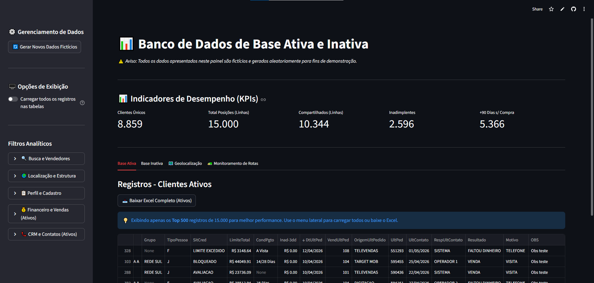
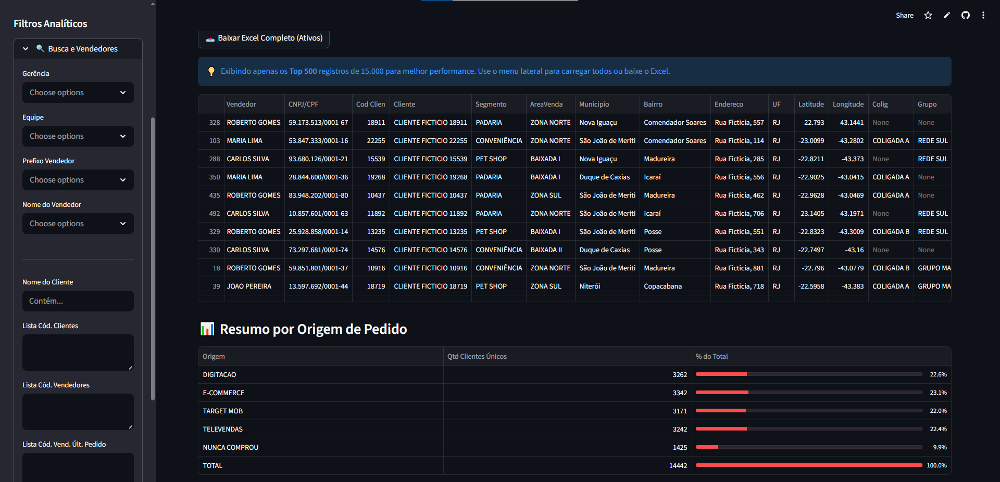
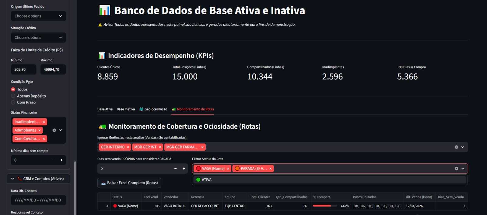
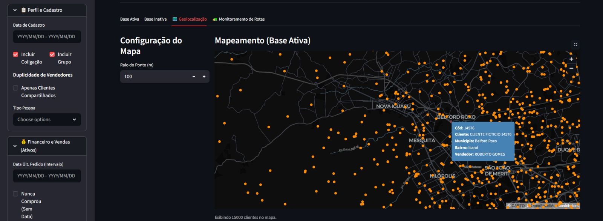
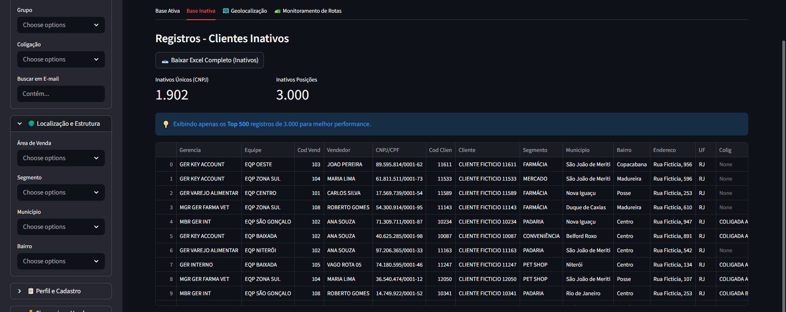

  # 📊 Sales CRM & Routing Dashboard | Painel de Inteligência Comercial

[](https://sales-crm-dashboard-app-sqqepgmzk37y6kyeekb3gt.streamlit.app/)
[](https://www.python.org/)
[](https://pandas.pydata.org/)

**[🚀 ACESSAR O APP AO VIVO (VERSÃO DEMO)](https://sales-crm-dashboard-app-sqqepgmzk37y6kyeekb3gt.streamlit.app/)**

> **Nota:** A versão em produção deste painel conecta-se diretamente a um banco de dados SQL Server corporativo. Para fins de portfólio e proteção de dados sensíveis (LGPD), o link acima roda uma versão espelho (`app_demo.py`) com um script embarcado que gera +15.000 linhas de dados fictícios realistas.

---

## 💡 Visão Geral do Projeto

Este projeto é um ecossistema interativo de análise de dados desenvolvido em **Python (Streamlit, Pandas, PyDeck)** focado em resolver desafios reais de logística de vendas e inteligência comercial. O painel transforma uma base de dados complexa em insights acionáveis, unindo a precisão analítica com uma interface fluida.

O objetivo principal da ferramenta é dar autonomia a gestores comerciais para mapear a saúde da carteira de clientes, identificar inadimplência, prevenir churn e otimizar a distribuição territorial da equipe de vendas de forma visual e intuitiva.



---

## 🛠️ Principais Funcionalidades

### 1. Monitoramento de KPIs e Resumo de Origens
Acompanhamento em tempo real de métricas críticas: contagem de clientes únicos, volume de linhas processadas, ocorrências de carteiras compartilhadas, inadimplência aguda e risco de churn (clientes sem compra há mais de 90 dias).


### 2. Gestão de Rotas e Ociosidade (Sales Routing)
Um motor de regras de negócio analisa o cruzamento entre quem é o *dono* do cliente e quem *realizou a última venda*. Isso permite identificar rotas "paradas" ou vagas, calculando o percentual de clientes que estão sendo atendidos por outros vendedores (Bases Cruzadas).


### 3. Geolocalização Avançada
Integração com a biblioteca PyDeck para plotagem espacial de coordenadas. O gestor pode visualizar a densidade de clientes por município, bairro ou área de venda estruturada, ajustando dinamicamente o raio de visão.


### 4. Gestão de Base Inativa e Filtros em Cascata
Separação clara entre clientes ativos e inativos. A barra lateral conta com um sistema de filtros em cascata avançado, permitindo buscas hierárquicas (Gerência > Equipe > Vendedor), cruzamento financeiro (Limite de Crédito, Situação, Condição de Pagamento) e histórico de CRM.


### 5. Exportação sob Demanda
Geração automatizada de relatórios em Excel (`.xlsx`) processados em memória (`io.BytesIO`). O arquivo gerado respeita 100% dos filtros visuais e lógicos aplicados pelo usuário na tela.

---

## 💻 Stack Tecnológico

* **Linguagem:** Python
* **Frontend / Framework:** Streamlit
* **Manipulação de Dados:** Pandas, NumPy
* **Visualização Espacial:** PyDeck
* **Banco de Dados (Produção):** SQL Server (`pyodbc`)
* **Exportação:** XlsxWriter
* **Ambiente:** Anaconda / python-dotenv

---

## ⚙️ Como executar localmente

Para rodar a versão de demonstração (com o gerador de dados) na sua própria máquina, siga os passos abaixo. Recomenda-se o uso do **Anaconda** para o gerenciamento do ambiente virtual:

1. **Clone o repositório:**
```bash
git clone [https://github.com/SEU_USUARIO/Sales-CRM-Dashboard-Streamlit.git](https://github.com/SEU_USUARIO/Sales-CRM-Dashboard-Streamlit.git)
cd Sales-CRM-Dashboard-Streamlit
```
### 2. Crie o ambiente virtual:

```bash
python -m venv venv
```

### 3. Ative o ambiente virtual:

**No Windows:**

```bash
venv\Scripts\activate
```

**No Linux / macOS:**

```bash
source venv/bin/activate
```

### 4. Instale as dependências:

```bash
pip install -r requirements.txt
```

### 5. Execute o aplicativo:

```bash
streamlit run app_demo.py
```

---

## 🔒 Para uso em produção

A estrutura original encontra-se no arquivo `app.py`. Para ativá-la:

1. Renomeie o arquivo `.env.example` para `.env`
2. Insira as credenciais de acesso ao seu banco de dados SQL Server

---

Desenvolvido com foco em **escalabilidade, arquitetura de dados e impacto nos negócios**.
